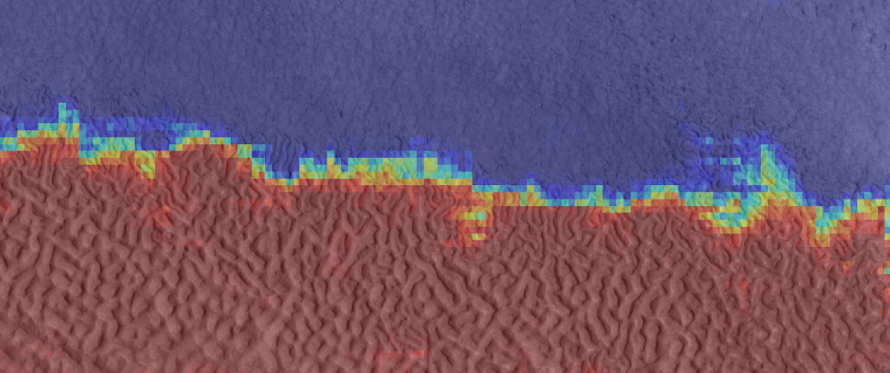
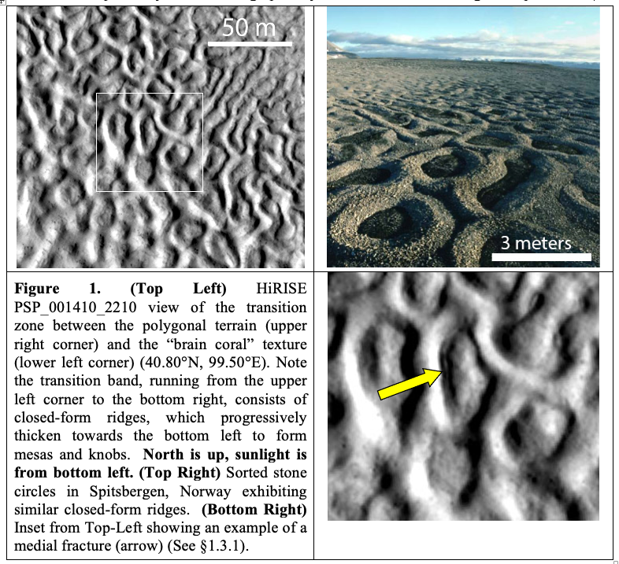
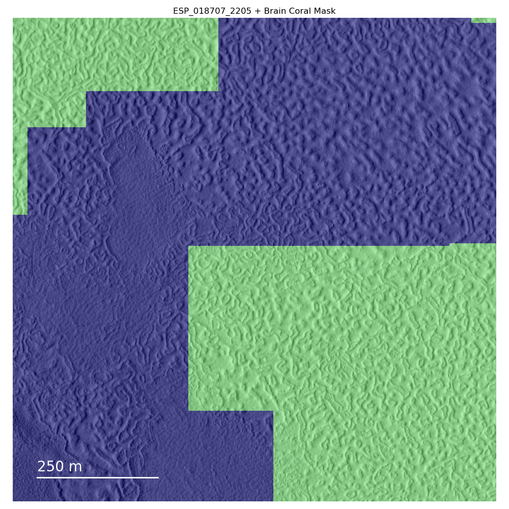
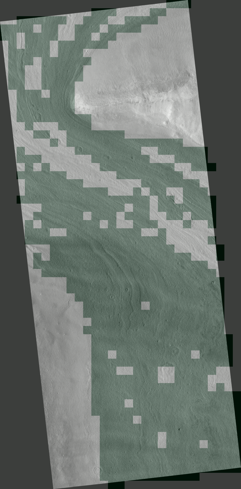
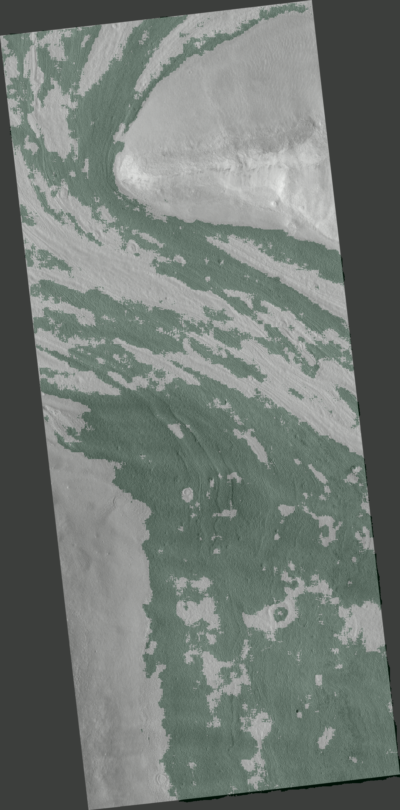
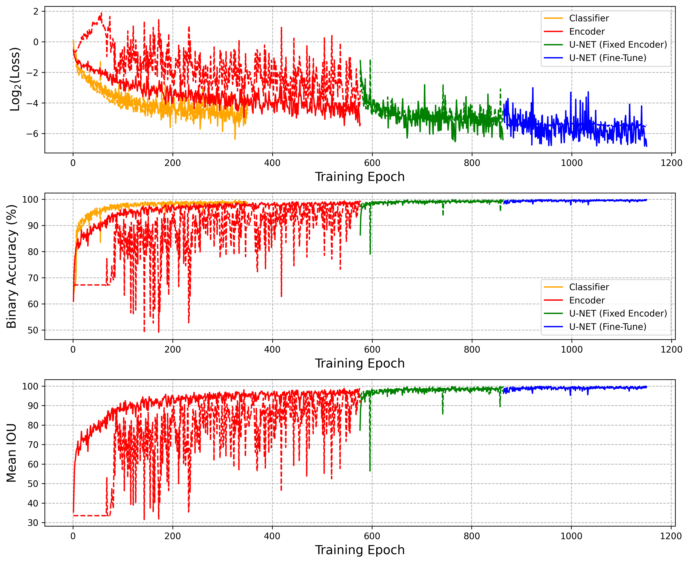
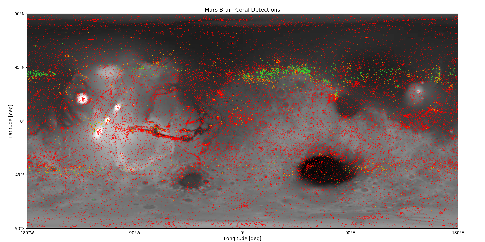
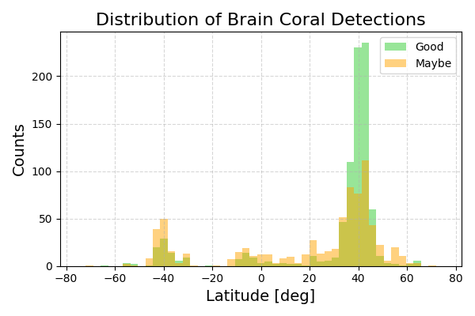

# Brain Coral Detection and Segmentation

One of the key drivers of the Mars Exploration Program is the search for evidence of past or present life.  In this context, the most relevant martian environments to search for extant life are those associated with liquid water; and locations that experience periodic thawing of near-surface ice. Here, we propose an investigation into the genesis of “Brain Coral Terrain”, a terrain on Mars whose similarity in morphology and scale to sorted stone circles on Earth suggests that it may have formed as a consequence of freeze/thaw cycles, and could be a high priority candidate for astrobiological exploration. 

For more information:
- [Arxiv Paper](https://arxiv.org/abs/2311.12292)
-  [Results Table](https://pearsonkyle.github.io/Mars-Brain-Coral-Network/)



## Mid Latitude Patterned Ground



[Dobrea et al. 2007](https://ui.adsabs.harvard.edu/abs/2007LPICo1353.3358N/abstract)

## Data

[HiRISE (High Resolution Imaging Science Experiment)](https://hirise.lpl.arizona.edu/) is a camera on board the Mars Reconaissence Orbiter which captures images from altitudes ranging ~250-400 km above the surface. The images have a range in resolutions due to the orbital position but on average are around 30-60 cm/px. The entire camera is capable of imaging 10’s of kilometers at a time and produces JPEG2000 images on the order of ~100-1000 MB each. As such, a machine learning algorithm needs to be efficient and robust in order to process images of this scale and to handle roughly 50 TB of images in the entire HiRISE archive.

## Getting Started

Set up a conda environment with the following dependencies:

**MAC silicon / Linux:**
```
conda create -n mdap python=3.11
conda activate mdap
conda install -c conda-forge glymur
pip install numpy opencv-python scikit-learn scikit-image seaborn beautifulsoup4 tqdm matplotlib tensorflow bokeh==2.4.30
pip install tensorflow-metal (mac only)
python -m pip install tensorflow[and-cuda] (linux only)
```

**Windows:**
```
conda create -n mdap python=3.10
conda activate mdap
conda install -c conda-forge cudatoolkit=11.2 cudnn=8.1.0 glymur
python -m pip install "tensorflow<2.11"
pip install numpy opencv-python scikit-learn scikit-image seaborn beautifulsoup4 tqdm matplotlib bokeh==2.4.3
```


**DCT Dependencies (Linux/Mac only)**

```
conda create -n mdap python=3.9
conda activate mdap
conda install -c conda-forge tensorflow-gpu==2.6.0 pyturbojpeg matplotlib
pip install numpy==1.20.0 opencv-python scikit-learn scikit-image==0.19.0 seaborn glymur beautifulsoup4 tqdm jpeg2dct==0.2.3 bokeh==2.4.3
```

The dependencies can get rather particular if you want to use the DCT classifier. Otherwise, we recommend using a newer version of tensorflow (> 2.6) which will allow you to use the MobileNETv3 Classifier, it's just as fast and more accurate. The architecture changed for MobileNET after 2.6 so the model weights won't load on any older versions of tf. The DCT classifier is still available in the `models/` directory if you want to use it.

## Searching for Brain Coral
1. Navigate to the [HiRISE Catalog](https://www.uahirise.org/catalog/) and download a JP2 image. Please use the JP2 Map-projected Black + White image. These will typically range in size from ~100-1000 MB

`wget https://hirise-pds.lpl.arizona.edu/download/PDS/RDR/PSP/ORB_001400_001499/PSP_001410_2210/PSP_001410_2210_RED.JP2`

2. Run the classifier on the image:

`python eval_classifier.py --input images/PSP_001410_2210_RED.JP2`

inspect the eval script if you want to use different weights or the dct classifier

3. Run segmentation for a high-res mask

`python eval_segmentation.py --input images/PSP_001410_2210_RED.JP2 --fast`

remove the `--fast` flag if you want to clean up individual pixel groups in the mask (can take ~1-2 hours to clean)

Various models are available in the `models` directory. 


| Model               | Train #    | Test # | F1 Score       | TP         | TN             | FP         | FN                   | 1Kx1K / sec |
|---------------------|------------|--------|----------------|------------|----------------|------------|----------------------|-------------|
| unet-512-spatial    | 58641      | 6516   | 0.998          | 99.8       | 99.7           | 0.2        | 0.3                  | 6.5         |
| cnn-128-spatial     | 58641      | 6516   | 0.996          | 99.6       | 99.6           | 0.4        | 0.4                  | 33.9        |
| resnet-128-spatial  | 58641      | 6516   | 0.995          | 99.7       | 99.4           | 0.6        | 0.3                  | 21.7        |
| cnn-256-spatial     | 11493      | 1277   | 0.991          | 99.2       | 99.0           | 1.0        | 0.8                  | 46.4        |
| resnet-256-spatial  | 13736      | 1527   | 0.990          | 99.6       | 98.5           | 1.5        | 0.4                  | 35.1        |
| **MobileNet-128-spatial**| 58641     | 6516   | 0.988          | 98.6       | 99.0           | 1.0        | 1.4                  | 97.7        |
| MobileNet-256-spatial| 13736     | 1527   | 0.977          | 96.0       | 99.5           | 0.5        | 4.0                  | 169.0       |
| cnn-256-dct         | 13736      | 1527   | 0.930          | 90.6       | 95.7           | 4.3        | 9.4                  | 228.4       |
| cnn-128-dct         | 58641      | 6516   | 0.912          | 90.4       | 92.1           | 7.9        | 9.6                  | 134.2       |
| resnet-256-dct      | 13736      | 1527   | 0.844          | 87.3       | 80.5           | 19.5       | 12.7                 | 130.0       |
| MobileNet-256-dct   | 13736      | 1527   | 0.836          | 93.6       | 69.6           | 30.4       | 6.4                  | 159.8       |

We recommend using one of the spatial MobileNET models for the classifier and the U-net for segmentation. The MobileNET classifier is more accurate than the DCT classifier but at the expense of being a 2x as slow. We argue MobileNET is a bit more robust due to the additional training data when using a smaller window size. Inference on a typical HiRISE image will take a few seconds with the MobileNET classifier (assuming you're using a GPU). The biggest bottleneck is usually downloading + opening the image (it's best to use multi-threading when decoding).

## How to create new training data

This repository already comes with lots of hirise images to identify multiple classes: 20 brain coral images and 129 background images. The training data is located in: `training/data` with directories pertaining to the classes used in the prediction algorithm. Masks identifying brain coral can be made by hand in photoshop or gimp. Below is a mosaic of tiles representing images correspoding to brain coral. Each tile is 512 x 512 pixels at the 0.25cm/px resolution.


When making a mask, the edges or border of the brain coral mask don't matter since they are not used when creating the training samples. The mask is ultimately tiled based on the input size of the algorithm (e.g. 512x512 pixels) and only full files are used as training data. Tiles with partial masks are not used due to the difficulty of labelling the brain coral border. Instead, the algorithm will learn how to define the boundary even if not specifically trained on it. The masks for the `background` class are simple, one pixel images which means any where in the image can be used to define the background tile except for the black border of the hirise images. Below is an example of a human made mask overlayed on the original image. It doesn't have the trace the brain coral perfectly since only the interior of the mask is used for training.



For more examples of masks see the `training/data` directory. If you don't want to manually design a mask in gimp or photoshop then first run the `eval_segmentation.py` script followed by: 

`python compare_masks.py -s -r 0` 

which will save a training mask at the same resolution as the original image. Please inspect the compare script to see how input images are handled. 

## Train the classifier
- Base Network: CNN
- Spatial Resolution: 1/16
- Preprocessing: Discrete Cosine Transform
- Input: 32x32x64 (corresponding to 256x256 pixel image at 1/16 the spatial res.)
- Output: 2 (classes=background, brain_coral)

`python train_classifier.py --mode dct --threads 8 --epochs 10 --res 2`

Training data will be downloaded in that script if it's not found on disk. We also tested a spatial classifier network which is as fast as the DCT one and arguably more accurate using the settings below:

- Base Network: MobileNetV3
- Spatial Resolution: 1/16
- Preprocessing: Normalization handled as first layer in network (Mean=0, Std=1)
- Input: 256x256x1
- Output: 2 (classes=background, brain_coral)

`python train_classifier.py --mode spatial --threads 8 --epochs 10 --res 2 --gpu 0`

Each of these training scripts will create three different classifiers: a vanilla CNN, one using MobileNetV3Small and ResNet. 


## Train the segmentation algorithm
- Base Network: MobileNetV3
- Spatial Resolution: 1/1
- Preprocessing: Rescaling or Normalization is handled as first layer in network
- Input: 512x512x1
- Output: 512x512x2

`python -u train_unet.py --threads 8 --size 512 --res 0 -e 7 --encoder --gpu 4 --preprocessing rescale`



The u-net trains in 3 different phases due to the complexity of the architecture. First an encoder is trained to produce a segmentation mask at a resolution of 32x32. Next a bunch of convolutional and upscaling layers are added at the output of the encoder with skip connections from layers in the encoder forming the U-net architecture. The first round of training the U-net keeps the encoder weights fixed but the upscaling side free. The second round of training fine-tunes the u-net by lowering the learning rate while keeping the encoder and decoder weights free.



## Running the pipeline

The pipeline uses a hybrid evaluation style with the two networks trained above. The classifier is designed to quick assess wether an image has brain coral in it and contains information about the spatial extent at a very low resolution. Consider it similar to something like a salience map or even region of interest. Once the image is flagged by the classifier it is later evaluated at the native resolution in the spatial domain with the U-net. 

Running on a cluster without segmentation (classifier only):

`python pipeline.py --segmentor "" --gpu 4 --base_url "/projects/mdap/HiRISE/ESP"`


or for the full-pipeline provide the segmentation weights as an input argument (classifier + segmentation):

`python pipeline.py -s 512 -ws models/unet_512_0_rescale_ft_weights.h5 -o output_512_rescale/ --gpu 7 --reprocess`

The flag `--reprocess` will overwrite existing masks otherwise those images are skipped to avoid reprocessing. The `--base_url` flag is used to point to the location of the HiRISE images on disk or over the web depending on whether `https` is in the string.



A map of candidate regions that contain Brain Coral plotted over elevation data. Our survey vetted 50,000 HiRISE images down to ∼500 candidates. Of those candidates, we manually vetted the top 50% with respect to area of detection and labelled the results above. Green areas indicate brain coral, orange dots represent a “maybe” label and red means no brain coral is present. The elevation data is blended from the Mars Orbiter Laser Altimeter (MOLA), an instrument aboard NASA’s Mars Global Surveyor spacecraft (MGS), and the High-Resolution Stereo Camera (HRSC), an instrument aboard the European Space Agency’s Mars Express (MEX) spacecraft.



# License

Copyright 2023, by the California Institute of Technology. ALL RIGHTS RESERVED. United States Government Sponsorship acknowledged. Any commercial use must be negotiated with the Office of Technology Transfer at the California Institute of Technology.
 
This software may be subject to U.S. export control laws. By accepting this software, the user agrees to comply with all applicable U.S. export laws and regulations. User has the responsibility to obtain export licenses, or other export authority as may be required before exporting such information to foreign countries or providing access to foreign persons.


# Acknowledgments

The research described in this publication was carried out in part at the Jet Propulsion Laboratory, California Institute of Technology, under a contract with the National Aeronautics and Space Administration. This research has made use of the High Resolution Imaging Science Experiment on the Mars Reconnaissance Orbiter, under contract with the National Aeronautics and Space Administration. We acknowledge funding support from the National Aeronautics and Space Administration (NASA) Mars Data Analysis Program (MDAP) Grant Number NNH19ZDA001N.
